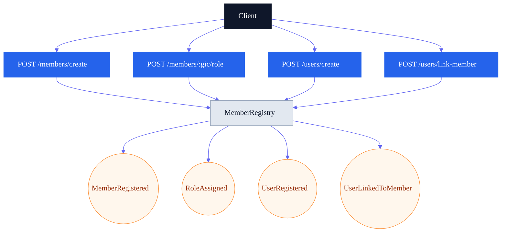
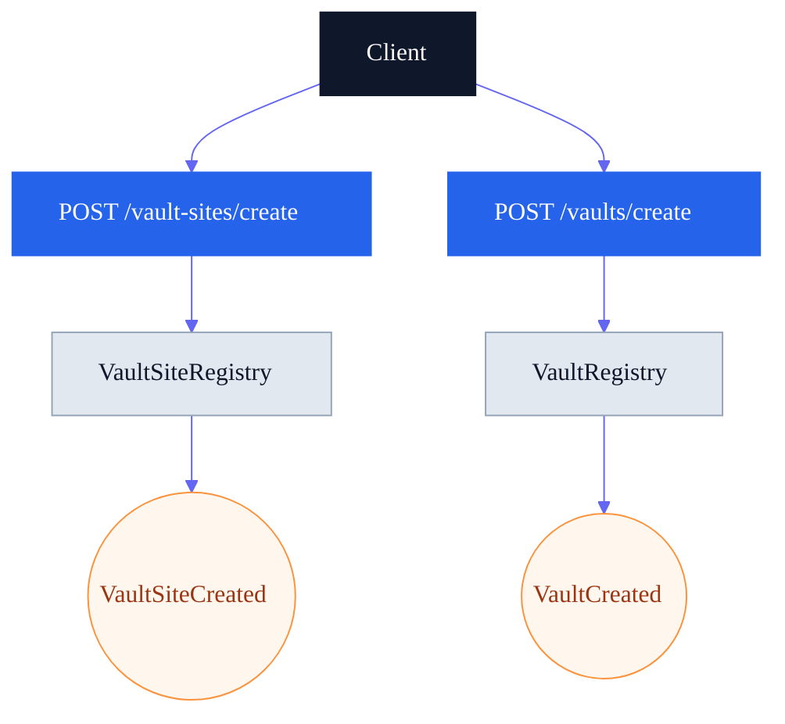
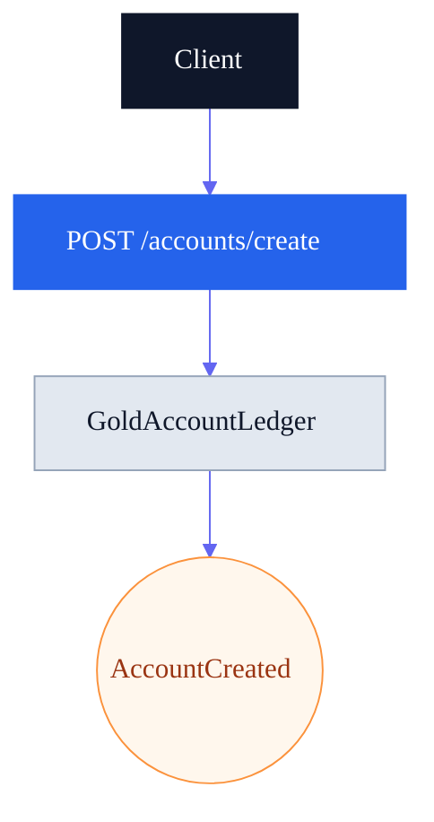
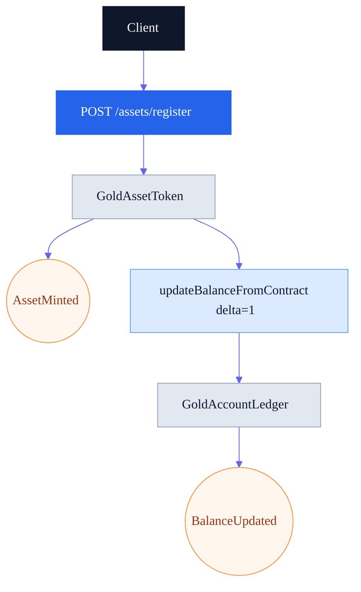
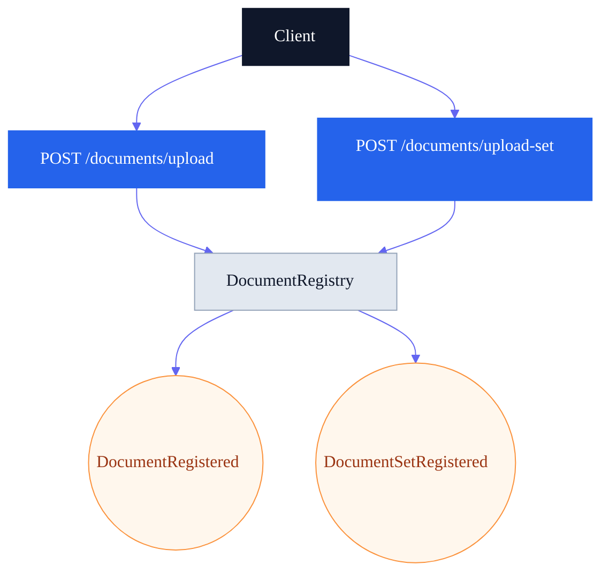
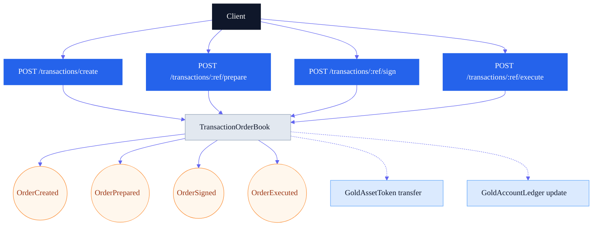
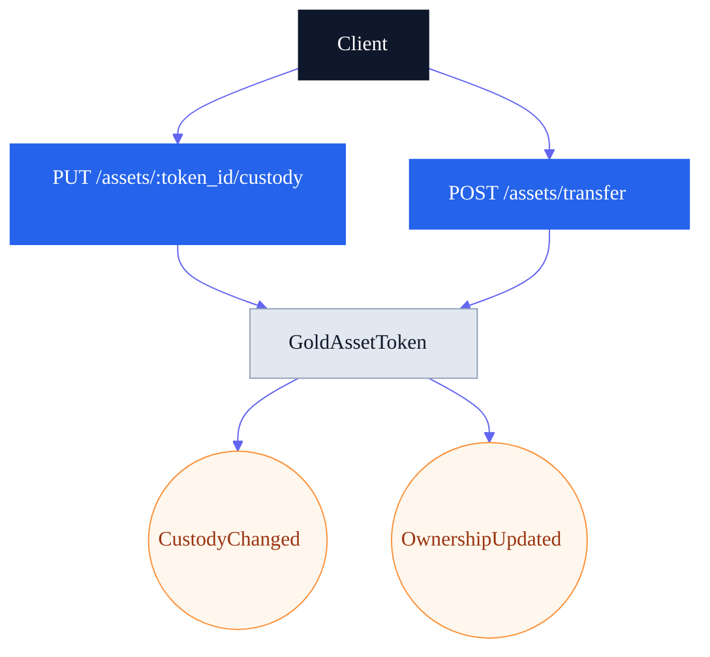
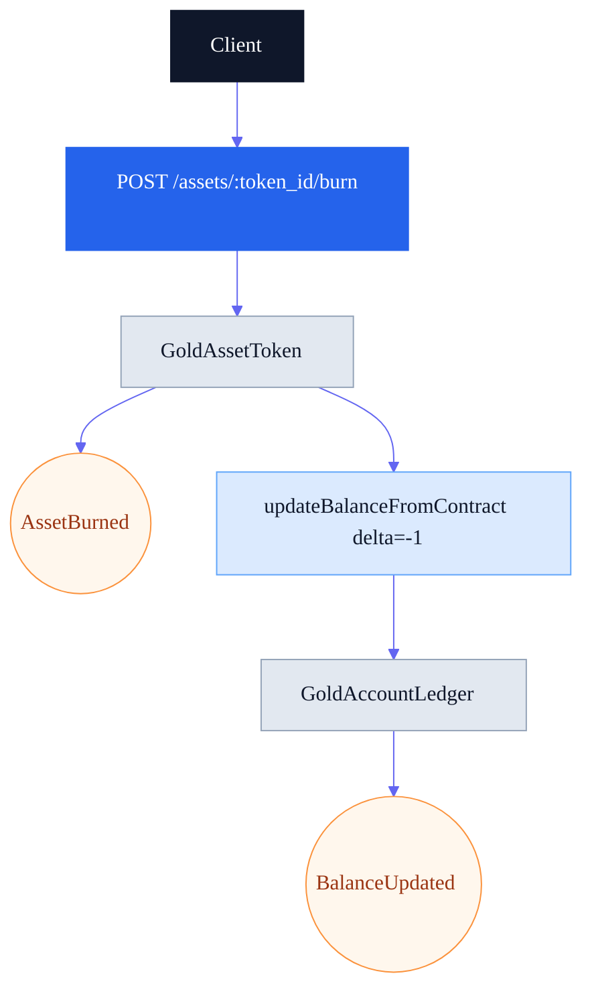
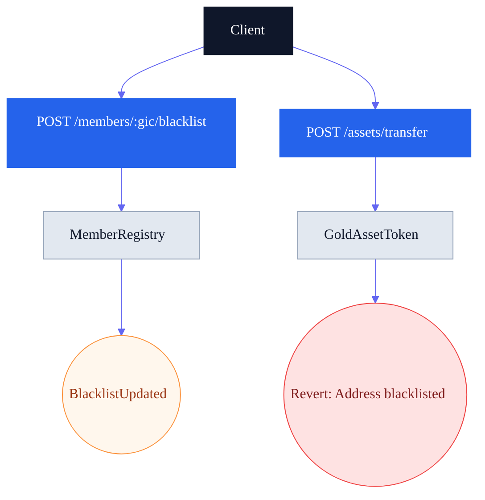

# Demo Scenarios (API -> On-chain Evidence)

This document provides visual, client-friendly scenarios showing each API call
and the corresponding on-chain state change or event. Use it as a script for
presentations and as a checklist for live demos.

## Roles Used in Demo
- GMO (admin)
- REFINER
- MINTER
- TRADER
- VAULT
- LSP
- AUDITOR (read-only)

## Pre-Demo Configuration
- Set balance updater so `GoldAssetToken.mint/burn` can credit/debit accounts:
  - `GoldAccountLedger.setBalanceUpdater(GoldAssetToken, true)`
- (Optional) Enable on-chain execution flow for orders:
  - `TransactionOrderBook.setExecutionOptions(true, true)`

## Scenario 1: Member Onboarding + Roles + Users

What we show: onboarding of an organization and its users.

On-chain evidence:
- `MemberRegistered`
- `RoleAssigned`
- `UserRegistered`
- `UserLinkedToMember`

## Scenario 2: Vault Site + Vault Setup

What we show: a VAULT member creates a vault site and vaults.

On-chain evidence:
- `VaultSiteCreated`
- `VaultCreated`

## Scenario 3: Create IGAN Account

What we show: a member creates an IGAN account.

On-chain evidence:
- `AccountCreated`

## Scenario 4: Mint Asset + Ledger Credit

What we show: a refiner or minter mints an asset and the ledger is credited.

On-chain evidence:
- `AssetMinted`
- `BalanceUpdated` (credit)

## Scenario 5: Document Anchoring

What we show: upload a document, then register a document set (SOD).

On-chain evidence:
- `DocumentRegistered`
- `DocumentSetRegistered`

## Scenario 6: Transaction Order Lifecycle

What we show: create, prepare, sign, execute.

On-chain evidence:
- `OrderCreated`
- `OrderPrepared`
- `OrderSigned`
- `OrderExecuted`
- Optional: `OwnershipUpdated` (transfer) + `BalanceUpdated` (ledger)

## Scenario 7: Custody Update + Transfer

What we show: custody metadata and transfer between owners.

On-chain evidence:
- `CustodyChanged`
- `OwnershipUpdated`

## Scenario 8: Burn Asset + Ledger Debit

What we show: burn asset and ledger debit.

On-chain evidence:
- `AssetBurned`
- `BalanceUpdated` (debit)

## Optional Scenario: Compliance / Blacklist

What we show: block transfers for blacklisted addresses.

On-chain evidence:
- `BlacklistUpdated`
- Transfer reverted on-chain
